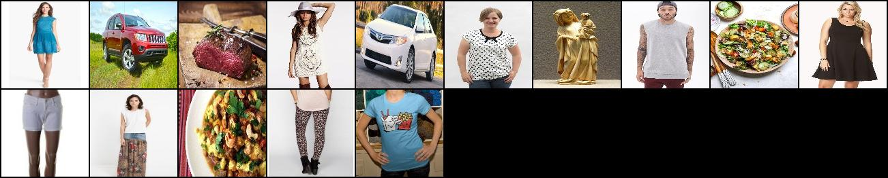
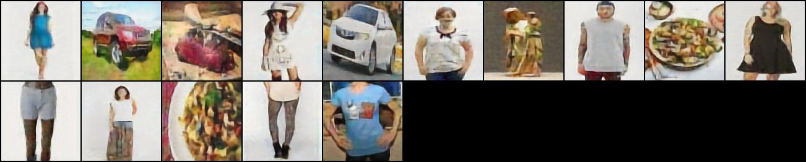

# VQ-VAE Image Compression Model

## Overview
This project implements a **Vector Quantized Variational Autoencoder (VQ-VAE)** model for image compression and reconstruction. The model takes **128x128x3** RGB images as input and compresses them into a **32x32x1** latent space using an encoder. The compressed representation is then quantized by replacing each latent vector with the closest match from a learned embedding space. Finally, a decoder reconstructs the image from the quantized latent representation.

This method enables efficient image compression while maintaining high-quality reconstructions. Additionally, the compact latent representations can be utilized to train other models with reduced dimensionality.

## Dataset
The model is trained using the **Google Universal Image Embeddings (128x128)** dataset, which can be accessed at the following link:
[Google Universal Image Embeddings Dataset](https://www.kaggle.com/datasets/rhtsingh/google-universal-image-embeddings-128x128)

## Installation
To set up the project, follow these steps:

1. Clone the repository:

2. Install dependencies:
   ```bash
   pip install torch torchvision pathlib python-box Flask
   ```

3. Run the application:
   ```bash
   python app.py
   ```

## Training
To train the model, follow these steps:

1. Configure your local data path by modifying `local_data_path` in `src.constants.config` according to your dataset location.
2. Run the following commands in sequence:
   ```bash
   python -m src.pipeline.data_ingestion_pipeline
   python -m src.pipeline.data_transformation_pipeline
   python -m src.pipeline.model_pipeline
   python -m src.pipeline.training_pipeline
   ```
## Test Results:

- Real Images:


- Reconstructed Images:



## License
This project is released under the MIT License.

